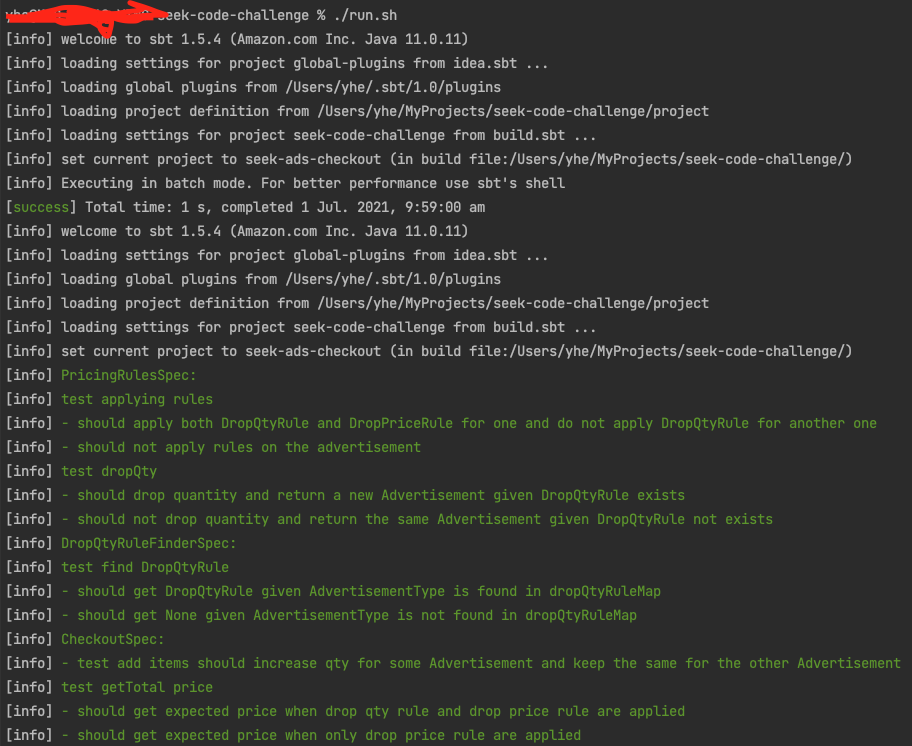
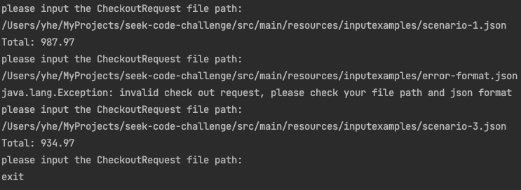

## Build & Test Environment
###JDK: 11.0.11.9.1-amzn, Scala: 2.13.6, SBT: 1.5.4, MacOS Big Sur 11.4

## How to run
####1. Please make sure jdk 11 and sbt 1.5.4 is installed in your local env
####2. grant "execute" access to run.sh file
####3. run "./run.sh", the command will compile, run tests and run Main, or you can run LocalMain in IDEs like: Intellij

####4. the terminal will promp out "please input the CheckoutRequest file path:" after giving correct file path and format, total price will be given

####5. The input json file contains the CheckoutRequest which will be processed by the system(please see the below format), some test files are in folder "resources/inputexamples"
```
{
  "customerId": 0,
  "items": [
    "Classic",
    "Standout",
    "Premium"
  ]
}
```
####6. If you encounter any issues like file path issues please let me know or contact me: yinghe.engr@gmail.com
####7. input "exit" to exit the system

## How Do I Design & Build - Thinking in Reality
####1. After reading and analysing the document, I suppose this "Checkout System" is a middle-ware microservice
```
a) For SRP(Single Responsibility Principle):
   this service should only care about handle CheckoutRequest and give checkout total price 
b) This service should be able to read customer data, 
   customer's drop price rule data, customer's drop quantiy rule data from Data Source
b) The other things like creating customers, creating customer drop price rules, 
   creating customer drop quantity rules should be its responsibility
c) For DIP(Dependency Inversion Principle) - decoupling of concrete modules
   the implementation of service Depends on abstracts, not on concretions:
   (1) for Repository Design, e.g:
       use trait AdvertisementRepo which can have different implementaion like: AdvertisementRepoFromJson
   (2) for mixin
       e.g: JsonSupport is an interface which have different decoding features
   (3) for service, e.g:
       CheckoutService is an interface it can have different implementations
```
####2. In reality this microservice could be a lambda service or k8s instance
```
a) handle CheckRequest from API call or event from SQS 
   or lambda call from the other services
b) define CheckRequest in json format (this format is 
   very popular to transfer on the internet)
  {
      "customerId": 0,
      "items": [
        "Classic",
        "Standout",
        "Premium"
      ]
  }
```
####3. How the system works
```
a) when a CheckRequest, the system will find the customer first
b) based on the found customer, the system will load DropPriceRule and DropQtyRule from Data Source
c) based on the customer's advertisement items, the system will apply rules and calculate total price
```

####4. The System is TDD design, the test cases can help understand the functions of each class

## Something this project needs to be improved
```
a) In reality: customers, customer's drop price rule, 
   customer's drop quantiy rule should be stored in real DataSource: 
   e.g: AWS DynamoDB, AWS Aurora
b) This system lack appropriate logging (due to limited time to implement)
c) The CheckRequest and reading from remote DataSource need to be handled asyncrhonously, non-blocking
d) The actual response should be a meaningful object in json format instead of just total price number
```